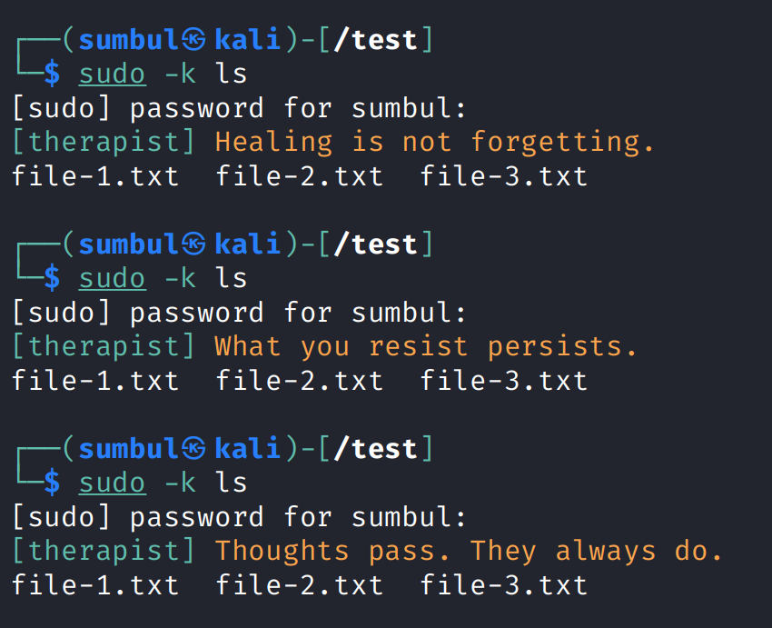

# Sudo Therapist

`sudo-therapist` inserts extra messages into the authentication flow of `sudo` with PAM. When a password prompt appears and credentials are verified successfully, the user must confront their therapist before the privileged command proceeds.



> [!WARNING]
> This project is for experimentation and humor. All authentication decisions remain enforced by `sudo`.

## Requirements

Runtime:
- Linux with [PAM](https://man7.org/linux/man-pages/man8/pam.8.html) enabled
- `sudo` built with PAM support
- Interactive terminal

Build:
- C compiler (gcc or clang)
- CMake 3.16+
- PAM development headers
  * Debian/Ubuntu/Kali: `libpam0g-dev`
  * RHEL/Fedora: `pam-devel`
  * Arch: `pam`

## Install

Download the `.deb` package from the latest [GitHub Releases](https://github.com/anar-bastanov/sudo-therapist/releases) and enable it after installation:

```bash
sudo apt install ./sudo-therapist_*.deb
```

Enable:

```bash
sudo pam-auth-update --enable sudo-therapist
```

Disable:

```bash
sudo pam-auth-update --disable sudo-therapist
```

Uninstall:

```bash
sudo apt purge sudo-therapist -y
```

### Build a `.deb` package

As opposed to downloading a ready package, you can:

```bash
sudo apt install build-essential cmake libpam0g-dev debhelper-compat devscripts fakeroot rsync
./scripts/make_deb.sh
sudo apt install ./dist/sudo-therapist_*.deb
```

### Other distros

Build and install from source. Also note that `pam-auth-update` is Debian-specific, so enabling and disabling requires manual PAM changes that are not documented here.

## Build from source

**DO NOT** mix `.deb` installs with source installs. If you installed the `.deb`, <u>purge it first</u>. Next, you can run the following CMake commands:

```bash
cmake -S . -B build -DCMAKE_BUILD_TYPE=Release
cmake --build build --config Release
sudo cmake --install build --config Release
```

Uninstall:

```bash
# Debian installs
sudo pam-auth-update --disable sudo-therapist

# Manual installs
# Remove the pam_sudo_therapist.so lines you added to the sudo PAM service file

./scripts/uninstall_cmake.sh
```

If `build/install_manifest.txt` is missing, reinstall using the same build directory to regenerate it, then run the uninstall commands above.

> [!CAUTION]
> This module interacts with the authentication stack. To avoid system errors and accidental lockout, be sure to disable the module before uninstalling.

## Test

The option `-k` invalidates cached `sudo` credentials so the next command requires authentication:

```bash
sudo -k ls
```

## Configure

Edit `/etc/sudo-therapist.conf` with these options:

* `group`: apply only to this group; empty for all groups (default: all)
* `tag_color`: The text color for the `[therapist]` prefix
* `tag_background`: The background color for the `[therapist]` prefix
* `text_color`: The text color for the message content
* `text_background`: The background color for the message content

### Group option example

```bash
sudo groupadd -f neutoric
sudo usermod -aG neutoric "$USER"
```

Then:

```text
group=neutoric
```

## License

Copyright &copy; 2026 Anar Bastanov <br>
Distributed under the [MIT License](http://www.opensource.org/licenses/mit-license.php).
